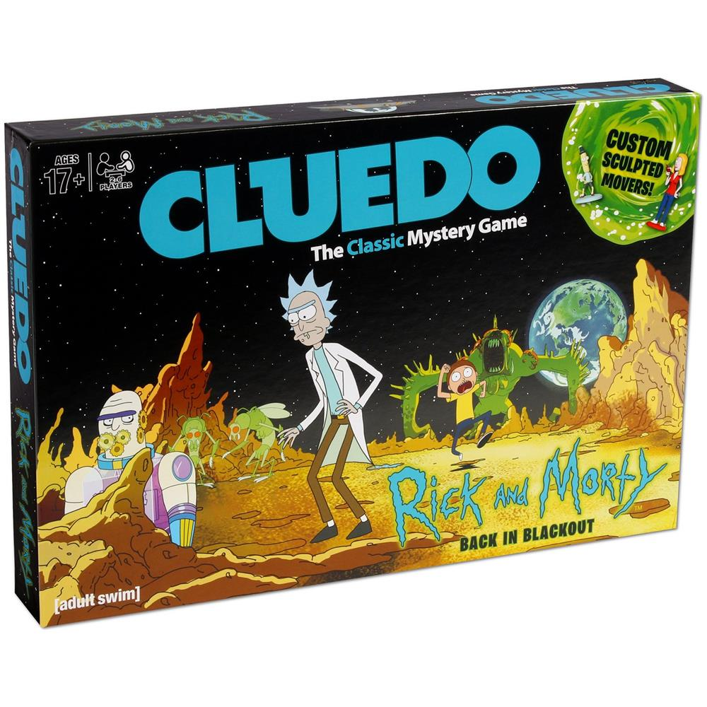

# README -- the RoboCLuedo Project -- ROUND 3

*Francesco Ganci* - S4143910 - A.A.2021/2022

---

```{toctree}
---
caption: Contents
---
./README-sphinx.md
```

---



---

## What you can find in this readme

This readme goes through the design ideas under the project. 

- expected behaviour of the project
- main design ideas
- Software Architecture components overview
- Software Architecture communication protocols overview

if you have more practical questions, you can find everything you want, detailed ad libitum, inside the [Official Documentation](officialdocs).

## Introduction -- RCL#3

The [RCL#3](https://github.com/programmatoroSeduto/ExperimentalRoboticsLab-Assignment-3) project, end of a long journey, wants to implement the architecture of a robot, using its sensors (in this case, cameras and a LIDAR sensor) to solve a *Cluedo*-style mystery, collecting hints across the environment and reasoning on them for finding the killer. The robot moves in the surroundings, trying to find as many ArUco IDs as possible, adding information to a OWL-based ontology for finding the solution of the case. 

### Technical Goals -- RCL#3

The main technical aim of this project is to *extend the architecture roposed in the third part of the project* with as the less adaptation work as possible. Indeed this version of the project keeps almost unchancged a lot of components from [RCL#2](https://github.com/programmatoroSeduto/ExperimentalRoboticsLab-Assignment-2), ad also something that comes from the [RCL#1](https://github.com/programmatoroSeduto/ExperimentalRoboticsLab-Assignment-1.git) project. 

Moreover, as in the other projects, a great care has been given to *the metodology of work*: not only writing the code, but also using and developing its documentation during the work. A big effort has been made as well, in documenting about the technologies involved in the implementation of this project, trying to find a way to make it work which could work also on other platforms as much as possible. Finally, the project comes with a rich *module testing* allowing to ensure the functioning of each module, either single or in combination with other elements of the architecture. See the official project documentation for further informations. 

### Differences from RCL#2

As said above, there are few, but important, technical dfferences between the two versions of the project:

- a new robot model, including 4 cameras and a brand new set of poses
- a new navigation system, with a new controller integrating **move_base** and the navigation stack
- support for "offline" localisation using **AMCL**
- a brand new **ArUco** vision system
- updates on the manipulation controller, supporting (a very raw) asynchronous manipulation
- a brand new system for launching the components of the architecture
- minimal adaptation of the ROSPlan package to cope with the cpecificities of ERL#3

And other little differences around in the code and in the structure of the project. A big effort have been made in making the project execution *as much fast as possible*: using such a sensing system, the perfomrance becomes a important topic to deal with. 

## Expected Behaviour -- RCL#3

Here's how the robot should behave, just as a short overview of how the RCL#3 project works. 

### ERL#3 Environment

The robot starts in the middle of a small house with a number of hints (arUco markers) spread out in the space (at least 5 per room). The robot can see the markers and detect them. Here's how the environment appears on Gazebo after the project has been run:


And here how it appears on RViz; the green balls are the positions of the rooms, called *waypoints*. The center waypoint, not indicated by a green marker, is located at the position where the robot starts the mission. 


### Behaviour

The robot **moves around looking for markers to detect**. Each marker has a identifier, which, after a request to the Oracle node, enables the system to access a hint to add to the Ontology. The hint will be used for reasoning about the plausible solutions of the case, trying to distinguish between che "COMPLETE" ones and the "INCONSISTENT" ones. 

Starting from a location, the robot navigates to another waypoint, using the cameras to "see" the markers slong the way. Arrived at the waypoint, the robot asks for admissible hypotheses to the Ontology. If at least one hypothesis is found acceptable, the robot navigates to the center and, once arrived there, the system introduces its solution to the Oracle node, which checks if the solution is either right or wrong. 

If the proposal is wrong, the robot continues to explore in search of other hints, after having discarded the proposed hypothesis. Otherwise, the robot ends working. 

The robot keeps going from one waypoint to another one, collecting hints until a plausible solution is available. 

## SW Arch -- Components

The project is a rich composition of many packages, resulting in a complex, heavy centralized architecture. It behaves as a classical hyerarchical architecture: sense, then plan, then act.

### highlights of the architecture

Here are the concept I used during each phase of the job:

- **separation** : Great care has been given in *guaranteeing the neat separation between components* 
	
	for instance, the RCL ROSPlan package doesn't interact directly with the motion controllers: it exposes a client to implement instead, which is called each time a ROSPlan action needs to perform the navigation. It requires a *bridge node*, that is a delegate between the ROSPlan framework and the real navigation system. 

- **abstraction** : the interfaces provided by each package *aims at hiding the implementation details*, enhancing a standard, intuitive way to use each package
	
	in particular, most of them provide a number of *directives*, i.e. spcecific operations an external node expects to be implemented in a way that the node don't want to know. The aRMOR package along with this project is a good example of this. 

- **flexibility and adaptability** : the neat separation between packages, alongside with the abstraction, lets the architecture to be more flexible and easily updatable. 

- **module testing** : it is a fundamental concept traversing all the lifecycle of this project since RCL#1
	
	The project contains a rich module testing section, allowing the developer to not wasting time in looking for bugs in a very complex, demanding architecture. Each package can be tested independently, and most of the times with just a bash script. Sometimes also some code has been provided in order to test the project.
	
	*Developing a rich debug system is a necessity* with such a large project. You cannot go on if you can't be sure at 100% that the components "at the bottom" work as expected. It helped me during the development phase hundreds of times, even revealing bugs whicc was very difficult to spot simply running the proejct.

### Components -- simplified schema

It highlights the centralized structure of the architecture. Each component here corresponds to a package used by the project. 

The mission manager contains the bridges above-mentioned (there are bridges for both the navigation and the manipulation), as well as the *main node* providing a high-layer planning by means of landmarks and aRMOR operations. 

```{uml}
@startuml

''' INFOS
title Project Architecture simplified
skinparam Padding 10
allow_mixing


''' COMPONENTS
database "aRMOR" as ARMOR
component "MoveIt!" as MOVEIT
component "Navigation Stack" as NAVSTACK
component "erl3 Oracle" as ORACLE
component "ROSPlan" as ROSPLAN

node "RCL mission manager" as MISSION_MANAGER
component "RCL Vision" as VISION
component "RCL aRMOR interface" as RCL_ARMOR
component "RCL ROSPlan" as RCL_ROSPLAN
component "RCL Movement Controller" as MOVEMENT
component "RCL hunter environment" as ENVIRONMENT


''' CONNECTIONS
ENVIRONMENT <--> NAVSTACK
ENVIRONMENT <--> MOVEIT
ENVIRONMENT <--> VISION
NAVSTACK <--> MOVEMENT
MOVEIT <--> MOVEMENT
MOVEMENT <--> MISSION_MANAGER
MISSION_MANAGER <--> RCL_ROSPLAN
ROSPLAN <--> RCL_ROSPLAN
MISSION_MANAGER <--> RCL_ARMOR
ARMOR <--> RCL_ARMOR
MISSION_MANAGER <--> VISION
VISION <--> ORACLE
MISSION_MANAGER -- ORACLE

@enduml
```

---

### Components -- extended schema 

> 
> Wanna see more? Take a look at the packages documentation inside the Official Documentation. 
> 

This schema wants to give an idea of how much the architecture of the project is extended. Inside it there are pointed out many ideas inside RCL#3:

- the ROSPlan side is a sort of mikrokosmos of components. The system uses the idea of *landmarks*, implementing the "low level planning system". See the official documentation, and in particular the design of the PDDL, for further details about such a planning policy. 
	
	The problem solution strategy is divided into three "steps", called *landmakrs* in the terminology of the project:
	
	- **REPLAN** : tidy the rosplan kb up, maing it ready for a new iteration of the strategy
	- **COLLECT** : move the robot in the environment, *using a topological localisation* integrated with the ROSPlan PDDL model
	- **SOLVE** : the final step, introduce the "assumed" solution of the case and check it; the robot moves towards the center before introducing the solution

- the movement controller package implements both the navigation system and the manipulation system. 
	
	the navigation system is divided into many layers (hierarchical architecture inside): the behavioural section, containing 
	
	- the *elementary behaviours* directly influencing the motion of the robot, 
	- combined into *composite behaviours* which group the elementary behaviours to make more structured motion strategies
	- and the *motion controllers*, components of the navigation manager (implemented as classes inside that node) providing a "cozy" abstraction for the navigation system: a external node sees onl a simple interface, without having the need to deal with the details of the implementation of the navigation system.
	
- the diagram also shows the components of the navigation stack, a novelty of RCL#3

Here's the diagram (I suggest you to open the image in a new tab of the browser... it is quite big)

```{uml}
@startuml

''' INFOS
title Project Architecture - extended
''' skinparam Padding 8
allow_mixing


''' COMPONENTS
package armor{
database "aRMOR" as ARMOR
component "RCL aRMOR interface" as RCL_ARMOR

RCL_ARMOR -- ARMOR
}

package "RCL Mission Manager"{
component "RCL mission manager" as MISSION_MANAGER
component "RCL manipulation unit" as MANIP_UNIT
component "RCL navigation unit" as NAV_UNIT

MISSION_MANAGER -- MANIP_UNIT
}

package "RCL ROSPlan" {
component "ROSPlan pipeline manager" as ROSPLAN
component "RCL kb_tools" as RCL_KBTOOLS
database "ROSPlan knowledge base" as ROSPLANKB
component "ROSPlan components" as ROSPLAN_COMPONENTS
file "PDDL RCL domain" as DOMAIN
file "PDDL RCL problem" as PROBLEM
node "feedback manager" as FEEDBACK
package "RCL ROSPlan Actions" as ROSPLAN_ACTIONS {
node REPLAN
node SOLVE
node COLLECT
}
FEEDBACK --> ROSPLAN
ROSPLAN_ACTIONS --> FEEDBACK
ROSPLAN_COMPONENTS -- ROSPLAN_ACTIONS

ROSPLANKB-- ROSPLAN_COMPONENTS
ROSPLANKB -- RCL_KBTOOLS
ROSPLANKB -- ROSPLAN
RCL_KBTOOLS -- ROSPLAN
DOMAIN -- ROSPLANKB
PROBLEM -- ROSPLANKB
ROSPLAN_COMPONENTS -- ROSPLAN
}

package "erl3"{
component "erl3 Oracle" as ORACLE
component "markers publisher" as MARKERS
}

package "RCL Vision" {
component "RCL vision detection" as VISION
component "RCL vision decoder" as VISION_DECODE

VISION -- VISION_DECODE
}

package "Simulated Environment" as ENVIRONMENT {
component "RCL robot 'hunter'"
node "Gazebo"
node "RViz"
}

package moveit {
component "MoveIt!" as MOVEIT
}

package "navigation stack" as NAVSTACK {
component "Move Base"
component "AMCL"
component "SLAM/GMapping"
}

package "RCL Movement Controller" {
component "RCL navigation manager" as MOVEMENT
component "RCL manipulation controller" as MANIPULATION
package behaviours {
node "bug_m"
node "move_base_nav"
node "head_orientation"
node "go_to_point"
}
}

''' CONNECTIONS
MISSION_MANAGER -- RCL_ARMOR
MISSION_MANAGER -- VISION_DECODE
MISSION_MANAGER -- ROSPLAN
MISSION_MANAGER -- ORACLE
VISION_DECODE -- ORACLE
MARKERS -- NAV_UNIT
VISION -- ENVIRONMENT
ENVIRONMENT -- MOVEIT
ENVIRONMENT -- NAVSTACK
MOVEIT -- MANIPULATION
NAVSTACK -- MOVEMENT
MANIP_UNIT -- MANIPULATION
NAV_UNIT -- MOVEMENT
NAV_UNIT -- ROSPLAN_ACTIONS

@enduml
```

---

## SW Arch -- communication protocols overview

Here are the temporal diagrams of the project, describing just the essential steps performed in communicating between packages

### Foreword -- diagrams conventions

- the *package temporal diagram* represents how different independe packages work together
- the *node temporal diagram* is more specific and goes deeper into how the nodes communicate each other
- the square note is used for exposing scenarios and hypotheses
- the rhomboid annotation underlines an operation inside the node or the package

### navigation using move_base (RCL#3)

**package temporal diagram**. The RCL#3 integrates a behaviour involving *move_base*. As said before, the package *robocluedo_mission_manager* offers delegates to enable the communicaton between two different packages. 

```{uml}
@startuml

title RCL#3 move_base navigation - package temporal diagram

''' ENTITIES 
collections ROSPLAN
collections MISSION
collections MOVEMENT

''' SEQUENCE
' == section ==
' ...
== First setup (first request) ==

MISSION -> MOVEMENT : SET controller ID=1
MISSION <- MOVEMENT : success
hnote over MISSION: waiting for markers

== Movement ==

ROSPLAN -> MISSION : request from ROSPlan action
MISSION -> MOVEMENT : navigation request
hnote over MOVEMENT : performing navigation
MISSION <- MOVEMENT : target reached
ROSPLAN <- MISSION : navigation ended

@enduml
```

**node temporal diagram**. The navigation is divided into many layers: the delegate (NAVIGATION_UNIT) inside the *robocluedo_mission_manager* package, the manager (NAVIGATION_MANAGER), the controller (NAVIGATION_CONTROLLER), the composite behaviour (MOVE_BASE_NAV) and the elementary behaviours (in this case only HEAD_ORIENTATION since MOVE_BASE is another framework, but in this case let's assume it is a behaviour similar to the GOTO_POIN in RCL#2). The robot first travels with a complex path towards the target, then, reached it, rotates to reach the final orientation. 

```{uml}
@startuml

title RCL#3 move_base navigation - node temporal diagram
' header ...
' footer ...

''' ENTITIES 
participant MOVE_TO order 0
participant NAVIGATION_UNIT order 1
participant NAVIGATION_MANAGER order 2
participant NAVIGATION_CONTROLLER order 3
participant MOVE_BASE_NAV order 5
participant HEAD_ORIENTATION order 6
participant MOVE_BASE order 5

''' SEQUENCE
' == section ==
' ...

== request ==
MOVE_TO -> NAVIGATION_UNIT : using RCL ROSPlan interface
hnote over NAVIGATION_UNIT 
	waiting for markers
end hnote
NAVIGATION_UNIT -> NAVIGATION_MANAGER : using RCL navigation req
note over NAVIGATION_MANAGER
	let's assume a controller 
	has been activated before...
	otherwise, the service returns 
	immediately
end note
NAVIGATION_MANAGER --> NAVIGATION_CONTROLLER : passing request (call)


== navigation job ==
NAVIGATION_CONTROLLER -> MOVE_BASE_NAV : switch ON
hnote over NAVIGATION_CONTROLLER
	waiting for a signal ...
end hnote
note over MOVE_BASE_NAV
	the behaviour receives 
	a final orientation to achieve
	and a target to reach
end note
MOVE_BASE_NAV -> MOVE_BASE : send goal
hnote over MOVE_BASE_NAV
	reading distance error ...
end hnote
MOVE_BASE_NAV -> MOVE_BASE : cancel goal
MOVE_BASE_NAV -> HEAD_ORIENTATION : switch ON
hnote over MOVE_BASE_NAV
	reading orientation error ...
end hnote
MOVE_BASE_NAV -> HEAD_ORIENTATION : switch OFF
NAVIGATION_CONTROLLER <- MOVE_BASE_NAV : send signal
NAVIGATION_CONTROLLER -> MOVE_BASE_NAV : switch OFF

== response ==
NAVIGATION_MANAGER <-- NAVIGATION_CONTROLLER : return
NAVIGATION_UNIT <- NAVIGATION_MANAGER : response (RCL movement controller)
MOVE_TO <- NAVIGATION_UNIT : response (RCL ROSPlan)

@enduml
```

### navigation using bug_m (RCL#2)

**package temporal diagram**. The RCL#2 uses simple behaviours in order to perform the navigation. The package *robocluedo_mission_manager* offers delegates to enable the communicaton between two different packages: RCL ROSPlan, and the movement controller package.

```{uml}
@startuml

title bug_m navigation - package temporal diagram

''' ENTITIES 
collections ROSPLAN
collections MISSION
collections MOVEMENT

''' SEQUENCE
' == section ==
' ...
== First setup (first request) ==

MISSION -> MOVEMENT : SET controller <b>ID=0</b>
MISSION <- MOVEMENT : <i>success</i>
hnote over MISSION: waiting for markers

== Movement ==

ROSPLAN -> MISSION : request from ROSPlan action
MISSION -> MOVEMENT : navigation request
hnote over MOVEMENT 
performing navigation 
with BUG_M behaviour
end hnote
MISSION <- MOVEMENT : target reached
ROSPLAN <- MISSION : navigation ended

@enduml
```

**node temporal diagram**. The navigation is divided into many layers: the delegate (NAVIGATION_UNIT) inside the *robocluedo_mission_manager* package, the manager (NAVIGATION_MANAGER), the controller (NAVIGATION_CONTROLLER), the composite behaviour (BUGM_NAV) and the elementary behaviours (in this case HEAD_ORIENTATION and GOTO_POINT). 

The robot moves backwards very slowly, trying to gain space for then performing the rotation. Successively, it rotates orienting its head towards the target. The trasvel proceeds along a straight line from the starting point to the target one. And finally, the robot orients itself to reach the final pose. 

```{uml}
@startuml

title bug_m navigation - node temporal diagram
' header ...
' footer ...

''' ENTITIES 
participant MOVE_TO order 0
participant NAVIGATION_UNIT order 1
participant NAVIGATION_MANAGER order 2
participant NAVIGATION_CONTROLLER order 3
participant BUGM_NAV order 5
participant HEAD_ORIENT order 6
participant GOTO_POINT order 5

''' SEQUENCE
' == section ==
' ...

== request ==
MOVE_TO -> NAVIGATION_UNIT : using RCL ROSPlan interface
hnote over NAVIGATION_UNIT 
	waiting for markers
end hnote
NAVIGATION_UNIT -> NAVIGATION_MANAGER : using RCL navigation req
note over NAVIGATION_MANAGER
	let's assume a controller 
	has been activated before...
	otherwise, the service returns 
	immediately
end note
NAVIGATION_MANAGER --> NAVIGATION_CONTROLLER : call function


== navigation job ==
NAVIGATION_CONTROLLER -> BUGM_NAV : switch ON
hnote over NAVIGATION_CONTROLLER
	waiting for a signal ...
end hnote
note over BUGM_NAV
	the behaviour receives 
	a final orientation to achieve
	and a target to reach
end note

note over BUGM_NAV
here the BUGM_NAV Could 
perform a backwards movement
for gaining manouver space
end note

BUGM_NAV -> GOTO_POINT : switch ON

hnote over BUGM_NAV
	reading position error ...
end hnote

hnote over GOTO_POINT
turning 
towards the target ...
end hnote

hnote over GOTO_POINT
navigating straight 
to the target
end hnote

BUGM_NAV -> GOTO_POINT : switch OFF

BUGM_NAV -> HEAD_ORIENT : switch ON

hnote over BUGM_NAV
	reading orientation error ...
end hnote

hnote over HEAD_ORIENT
	turning
end hnote

BUGM_NAV -> HEAD_ORIENT : switch OFF

NAVIGATION_CONTROLLER <- BUGM_NAV : send signal
NAVIGATION_CONTROLLER -> BUGM_NAV : switch OFF

== response ==
NAVIGATION_MANAGER <-- NAVIGATION_CONTROLLER : return
NAVIGATION_UNIT <- NAVIGATION_MANAGER : response (RCL movement controller)
MOVE_TO <- NAVIGATION_UNIT : response (RCL ROSPlan)

@enduml
```

### manipulation (RCL#3) -- asynchrononus manipulation

**node temporal diagram**. This feature has been introduced for collecting much more hints in the space than in the case when the robot performs a manipulation always in the same way. The manipulator continuously changes the camera framing for spotting new markers in the space. This often causes a quicker solution time. 

Here's how this feature works. The mission manager keeps it active, and turns off it only during the SOLVE phase. 

```{uml}
@startuml

title Asynchronous Manipuation - RCL#3

''' ENTITIES
participant MISSION_MANAGER
participant MANIPULATION_UNIT
participant MANIPULATION_CONTROLLER
participant MOVEIT

== enable automatic manipolation ==

MISSION_MANAGER -> MANIPULATION_UNIT : switch <b>ON</b>
MISSION_MANAGER <- MANIPULATION_UNIT : <i>success</i>

== automatic manipulation cycle ==

MANIPULATION_UNIT -> MANIPULATION_CONTROLLER : send random pose
hnote over MANIPULATION_UNIT
wait tot seconds
end hnote
note over MANIPULATION_UNIT
let's assume the cycle time
of the MANIPULATION_UNIT is
large enough to complete the movement
end note

MANIPULATION_CONTROLLER -> MOVEIT : call move()
MANIPULATION_CONTROLLER <-- MOVEIT : end of the motion

MANIPULATION_UNIT -> MANIPULATION_CONTROLLER : send random pose
hnote over MANIPULATION_UNIT
wait tot seconds
end hnote

MANIPULATION_CONTROLLER -> MOVEIT : call move()
MANIPULATION_CONTROLLER <-- MOVEIT : end of the motion

note over MANIPULATION_UNIT, MOVEIT
. . . and so on . . .
end note

== disable automatic manipulation ==

note over MISSION_MANAGER
the MISSION MANAGER can issue the 
command in any time
end note

MANIPULATION_CONTROLLER -> MOVEIT : call move()
MANIPULATION_CONTROLLER <-- MOVEIT : end of the motion

MANIPULATION_UNIT -> MANIPULATION_CONTROLLER : send random pose
hnote over MANIPULATION_UNIT
wait tot seconds
end hnote

MISSION_MANAGER -> MANIPULATION_UNIT : switch <b>OFF</b>
note over MANIPULATION_UNIT
there's still a residual movement to perform;
the unit doesn't block that movement 
(this could be a problem ... see you in
the next update)
end note
MISSION_MANAGER <- MANIPULATION_UNIT : <i>success</i>

MANIPULATION_CONTROLLER -> MOVEIT : call move()
MANIPULATION_CONTROLLER <-- MOVEIT : end of the motion


@enduml
```

### Vision system workflow

**node temporal diagram**. This schema wants to clarify how the vision works. Take into account that *markers detected twice don't cause a new publication from the VISION_DETECT node*, for performance reasons. 

```{uml}
@startuml

title Vision - RCL#3

''' ENTITIES
participant ENVIRON
participant VISION_DETECT
participant VISION_DECODE
participant ORACLE
participant MISSION_MANAGER
participant ARMOR

== video stream analysis ==

note over ENVIRON
let's assume a regular stream
from the four cameras of the robot
end note

note over VISION_DETECT
to understand the situation, let's say
that the decode spend the time of
4 frames to end the detection
end note

hnote over VISION_DETECT
waiting messages
from cameras streams
end hnote

ENVIRON -> VISION_DETECT : FRAME from ID=0

hnote over VISION_DETECT
START detect ID=0
(dropping the other frames)
end hnote

ENVIRON -> VISION_DETECT : FRAME from ID=1

note over VISION_DETECT
only one thread can access 
the decoder each time. 
Hence, ID=1 is discarded.
end note

ENVIRON -> VISION_DETECT : FRAME from ID=0
ENVIRON -> VISION_DETECT : FRAME from ID=2

hnote over VISION_DETECT
STOP detect ID=0
end hnote

ENVIRON -> VISION_DETECT : FRAME from ID=2

hnote over VISION_DETECT
START detect ID=2
(dropping the other frames)
end hnote

ENVIRON -> VISION_DETECT : FRAME from ID=0
ENVIRON -> VISION_DETECT : FRAME from ID=0
ENVIRON -> VISION_DETECT : FRAME from ID=3

hnote over VISION_DETECT
STOP detect ID=2
end hnote

note over ENVIRON
sending continuously four
streams to the detection
end note

== detected a new ArUco marker ==

hnote over VISION_DETECT
WORKING CYCLE
is searching for new hints
to publish...
end hnote

note over VISION_DETECT
FOUND HINTS :
    ID=33
    ID=42 
    ID=1 
    ID=15
end note

VISION_DETECT -> VISION_DECODE : ID=33
VISION_DETECT -> VISION_DECODE : ID=42

VISION_DECODE -> ORACLE : decode ID=33
VISION_DECODE <- ORACLE : ID=33 decoded (hID, key, value)
VISION_DECODE -> MISSION_MANAGER : publish ID=33
MISSION_MANAGER -> ARMOR : ADD HINT
MISSION_MANAGER <- ARMOR : <i>success</i>

VISION_DETECT -> VISION_DECODE : ID=1
VISION_DETECT -> VISION_DECODE : ID=15

VISION_DECODE -> ORACLE : decode ID=42
VISION_DECODE <- ORACLE : ID=42 decoded (hID, key, value)
VISION_DECODE -> MISSION_MANAGER : publish ID=42
MISSION_MANAGER -> ARMOR : ADD HINT
MISSION_MANAGER <- ARMOR : <i>success</i>

VISION_DECODE -> ORACLE : decode ID=1
VISION_DECODE <- ORACLE : ID=1 decoded (hID, key, value)
VISION_DECODE -> MISSION_MANAGER : publish ID=1
MISSION_MANAGER -> ARMOR : ADD HINT
MISSION_MANAGER <- ARMOR : <i>success</i>

VISION_DECODE -> ORACLE : decode ID=15
VISION_DECODE <- ORACLE : ID=15 decoded (hID, key, value)
VISION_DECODE -> MISSION_MANAGER : publish ID=15
MISSION_MANAGER -> ARMOR : ADD HINT
MISSION_MANAGER <- ARMOR : <i>success</i>


@enduml
```

## Mission manager workflow

Here's the state diagram of the mission manager. Please take into account that the states REPLAN, COLLECT, and SOLVE, are *landmarks*; see the documentation about the *robocluedo_rosplan* package for further informations. 

The diagram doesn't show the status FAULT_COUNT which, as the name suggests, counts the unexpected (and unexplained) failures. The node has a counter of failures, and when the counter reaches zero, the node closes wuthout succeeding the mission. This strategy *could be replaced, or altered, in future updates.*

```{uml}
@startuml

state REPLAN
REPLAN : clean the kb

state COLLECT
COLLECT : move the robot and \n collect hints around

state ASK_ORACLE
ASK_ORACLE : check if in the ontology \n there are valid hypotheses \n to propose to the Oracle

state SOLVE
SOLVE : move to the center\n ready to introduce \n a solution

state ASK_ONTOLOGY
ASK_ONTOLOGY : check the solution\nask to the Oracle

''' state MISSION_STATUS_COUNT_FAULT
''' MISSION_STATUS_COUNT_FAULT : unexpected situation

[*] --> REPLAN : mission manager begins (like Batman...)
REPLAN --> COLLECT : still mumbleing
COLLECT --> ASK_ONTOLOGY : arrived at the waypoint
ASK_ONTOLOGY --> COLLECT : no bright ideas
COLLECT --> REPLAN : end of the explorable waypoints!
ASK_ONTOLOGY --> SOLVE : at least one possible solution found
SOLVE --> REPLAN : need for updating the paths
REPLAN --> SOLVE : possible solution ready
SOLVE --> ASK_ORACLE : at the center
ASK_ORACLE --> [*] : mystery solved!
ASK_ORACLE --> REPLAN : solution wrong

@enduml
```

## ROSPlan landmarks -- temporal diagrams

The mission manager makes a high level planning, whereas the RCL ROSPlan framework performs a *mid-level planning*: the mission manager divides the mission into a *policy* made of some macro-steps, and the ROSPlan package decides how to perform such macrosteps expanding them in a sequence of actions according to the situation registered in the ROSPlan knowledge base.

This leads to a more elaborated architecture for this framework, but also makes more flexible the behaviour of the system. 

The following diagrams shows not only what happens when a landmark is requested, but also how the MISSION_MANAGER carries out the ellaboration of the landmarks. 

### REPLAN landmark

```{uml}
@startuml

title landmark execution - REPLAN

''' ENTITIES
participant MISSION_MANAGER
participant PIPELINE
participant KB_INTERFACE
participant LOAD
participant PLAN
participant PARSE
participant DISPATCH

'' TEMPORAL DIAGRAM
== planning phase ==

note over MISSION_MANAGER: try to load and solve the problem

MISSION_MANAGER -> PIPELINE : load (landmark REPLAN) and solve

PIPELINE -> KB_INTERFACE : prepare REPLAN
PIPELINE <- KB_INTERFACE : <i>always success</i>

PIPELINE -> LOAD : trigger loading
PIPELINE <- LOAD : <i>success</i> (immediately)
hnote over PIPELINE: waiting 'load' output
PIPELINE <- LOAD : 'load' output

note over PIPELINE
let's assume that everything went fine
end note

PIPELINE -> PLAN : solve the problem
PIPELINE <- PLAN : <i>success</i> (immediately)
hnote over PIPELINE: waiting 'solve' output
PIPELINE <- PLAN : 'solve' output

note over PIPELINE
let's assume that everything went fine
end note

MISSION_MANAGER <- PIPELINE : <i>success</i>

== dispatch phase ==

MISSION_MANAGER -> PIPELINE : parse and dispatch

PIPELINE -> PARSE : parse plan
PIPELINE <- PARSE
hnote over PIPELINE: waiting 'parse' output
PIPELINE <- PARSE : 'parse'

PIPELINE -> DISPATCH : dispatch plan
note over MISSION_MANAGER, DISPATCH : it requires a lot of time: the system is running the RCL ROSPlan actions
PIPELINE <- DISPATCH : end execution

MISSION_MANAGER <- PIPELINE : <i>success</i>

@enduml
```

### About COLLECT and SOLVE landmarks

the procedure is always the same for the other landmarks: the mission manager splits the landmark execution in two phases in the same way. Obviously, if something could go wrong, the procedure would be shorter, and the MISSION_MANAGER would spend a bit to understand what went wrong. 

## working hypotheses

Few assumptions are needed, since the architecture tries to interact with general-purpose frameworks, using standard ways for interacting with the low level system. The most important assumption is that *the rules of the game are satisfied*, otherwise the behaviour of the robot is not determined. 

### About the environment

- the robot moves on a flat floor: always room can be reached by moving the roobot on the same floor (the house has only one, perfectly flat, floor)
- the environment could be "maze-like", but there should be space enough for allowing the robot to manouver 
- the topology of the environment is well known, as well as the cartesian coordinates of the waypoints
	- there's a node publishing the cartesian positions of the markers
	- and the *topological map of the environment* is known in advance

### About the markers and the sensing

- all the informations inside the environment are valid ArUco markers
- the stream from the cameras is informative enough
	- there are four cameras, at a low frequency each of them, but there are "x4" informations from around the robot
	- this means that, despite the methods designed to make the detection faster (mainly based on *drop some frames*), the system detects a lot of markers even with these conditions
	- in other words, the system discards fewer useful frames than it accepts, keeping the stream uniformly informative
	- so, *why taking the entire volume of data from the cameras?* We can discard some frames, i.e. *not executing the ArUco detection on these frames*
- the ArUco markers are clearly visible
	- there are no "hidden markers" inside the environment
- *the solution can be found in the markers of the environment*
	- the robot system has not a way to understand when the solution cannot be found in the environment
	- such a feature would require to detect and count the markers
	- but ... how to be sure that the markers detected are all the markers inside the space? After all, the robot vision system could easily miss one marker
	- hence, the robot can do no more than *keeping going aroung in search of a decisive hint*

### About the reasoning

- the mystery can be solved at least with a two-steps policy COLLECT, SOLVE
	- it is mostly due to the rules of the game
	- *if the game changes, the policy should be reviewed* accordingly to the new rules
	- in particular, if the problem cannot be reduced in a combination of two general steps, the planner shall provide other landmarks

## Limitations

- the robot can work only in well-known environments. It doesn't support free exploration
	- the free exploration requires the robot to choose by itself the waypoints, maybe based on the measurements from the laser sensor, or other systems
	- currently, there's no such a functionality
- *no secure communication error handling*. 
	- there could be a big deal try to run the achitecture distributed on a WiFi network: when a service call fails for instance, most of the nodes of the project are not able to cope with that in a acceptable situation. Most of times the node simply closes
	- overcoming this problem requires a long work of code review and, sometimes, re-design

## Improvements and future develops

**Create a distributed version of the architecture, with multiple robots**. Thanks to the strict separation between the components applied during the design and then during the implementation, the architecture can be extended to many robots inside the same environment. Some components can be centralized, such as the part concerning the ontology. The main problem in this case could be the to find a tradeoff between the       bandwidth required to enable the robots to communicate with the central system, and the computational capabilities onboard. 

**Architectural Review of the ROSPlan package**. Currently the knowledge base interface inside the *robocluedo_rosplan* package is of no use for nodes outside. There are many situations in which having directives exposed by the knowledge base interface can be useful. For instance, the code of the pipeline manager, currently *too much complex*, can be simplified a lot distributing the capability to explain a failure on two nodes. And, finally, the capability to write inside the ontology, taking into account the characteristics of the PDDL problem, is always useful. For these reasons, the ROSPlan implementation should be reviewed in order to provide a better supporto to the working cycle. The current package can be considered a *first prototype*, and it shall be formalized from the architectural point of view, and reimplemented, taking into account also the *directives* and the *features* given the PDDL model. 

**Manipulation Controller**. The manipulation approch can be heavily reviewed. The robot currently uses a very raw implementation of a moveit-based controller using well-known poses only. The cartesian plan should be introduced, and the asynchronous manipulation should be improved. Even a end effector should be defined. 

**Navigation manager and controllers**. The current structure can be improved a lot. First of all, you can notice by running the project that sometimes the robot tends to stop suddenly and to pitch, and this is due mainly to a not so good implementation of the navigation complex behaviour using move_base, which refreshes the path each tot seconds. This time is used because sometimes the path generated by move_base is absolutely pointless, hence the robot tries to replan in a different position, hoping that the outcome of the planner will be different. And fortunately, it works, but the fact that the robot stops suddenly is a drawback to be solved for sure. Moreover, the current navigation manager is very near to be a prototype: the approach works quite good, even if the problem is too much simple to see any relevant advantage from the approach with navigation controllers, but it should be implemented in a more tidy way. For instance, the system shall be divided into several files, instead of a long one a bit lasagna-code style. Honestly, I wanted to try something more elaborated with that: I like to test something more challenging with C++ sometimes, doing *real coding*. But I haven't had too much time to give to this eperiment a decent form (you cannot make the navigation perfect if you have to deal with literally *everything* inside the project: I'm not a team). It would be for sure a aspect to work on in another update. 

**URDF model improvements**. The current module, although it works quite good, it is too much basic. The physic can be improved, regulating with more attention the inertias of the components. Also the controllers can be improved. A code review on the model could help as well. 

**Logging and testing**. This third project revealed a problem in the approach I applied until now: the console logging wastes a lot of computational power. Another problem related is that the entire text on the console is also written on the log files, causing gigabytes of pointless data in the ROS logs. *The aspect has been completely neglected* until now, since the projects have been too much simple to make evident this error in the approach used for coding. During the optimization of the project, a large part of the code has been endowed with a primitive, not completely satisfying, develop mode, which is just a workaround for disabling the logs, but *it is not enough*. The idea to have a debug system alongside with the project is quite good, but it should be applied well. Currently the C++ nodes are the only ones to have a evelop mode; the Python nodes haven't such a similar mode, preferring to "comment" the prints. Theproject makes considerable improvements with the idea of the module testing, but it would have been better to develop a realistic, standard approach for testing from the beginning; the current testing method has been developed during the project, which is definitely not a good way of work. Standard testing methods should have been present from the beginning. 

**Adding a real graphical interface**. The project completely lacks of a decent user interface, which is, in my opinion, one of the most serious limitations of the project, after the one about the logging and the testing I told you before. The user, and the developer as well, should be enabled to understand what's wrong using a GUI instead of many prints on a console. A GUI allows to see the status of the entire project *at a glance*, instead of reading endless logs and console messages trying to grasp something. Also the image visualisation should be improved, allowing the user to select one camera to visualise, for instance. 

## Author and Contacts

A project designed and developed by Francesco Ganci (S4143910)

- **Email** : [*S4143910@studenti.unige.it*]()
