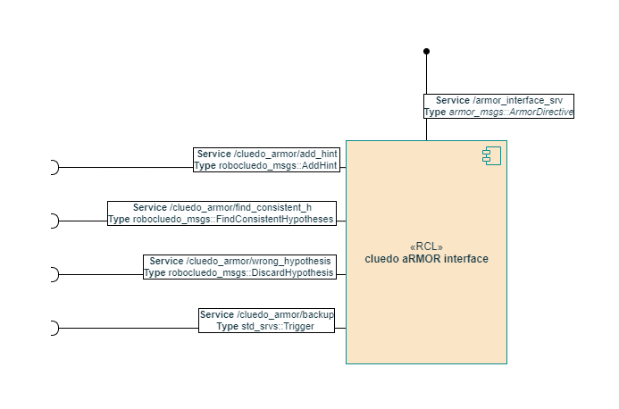

# aRMOR UML CLASS -- old schematics

```{toctree}
./armor-old-schematics.md
```

see the first part of the project.

## component schema



## the old arch schema

here's how the component were linked to the previous version of the architecture. 


