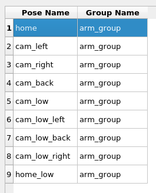

# the RoboCLuedo Project no.3 -- robot "hunter" URDF model -- User Manual

---

```{toctree}
---
caption: Contents
---
./robocluedo-hunter-user-manual.md
```

---

## Model file structure

inside the folder `robocluedo_dependencies/robocluedo_hunter_urdf_model/robot/` there are these files:

- `generate_model.sh` is a script to test the correctness of the model; it also generates a `.pdf` schematic of the model

- `robocluedo_xacro.xacro` is (as the name suggests) the XACRO model of a robot labeled **robocluedo_robot**. the model is split into three files:
	- `robocluedo_gazebo_materials` : graphical appearance of the robot
	- `robocluedo_chassis` : the moving platform of the robot
	- `robocluedo_arm` : the robotics arm
	- `robocluedo_arm_gripper` : the gripper of the robotic arm; it includes the link labeled *cluedo_link*
	- `robocluedo_gazebo_sensing` : definition of the Gazebo pluging related to the sensing; vision, laser, everything inside this file
	- `robocluedo_sensing` : this file contains the sensors mounted on the robot
	- `robocluedo_gazebo_plugins` : definition of the Gazebo plugins, without the sensing part
	- `robocluedo_transmission` : containing the Gazebo controllers

---

## HOW TO generate the model

execute the file `generate_model.sh`; the URDF and its schematic will be located into the folder `model/` with names 

- `robocluedo_robot.urdf` for the URDF model, 
- and `robocluedo_robot.pdf` for the schematic

the output should be like the following:

```text
robot name is: robocluedo_robot
---------- Successfully Parsed XML ---------------
root Link: base_link has 9 child(ren)
    child(1):  arm_base_link
        child(1):  arm_link_01
            child(1):  arm_link_02
                child(1):  arm_link_03
                    child(1):  cluedo_link
                    child(2):  camera_arm
    child(2):  link_a_left_wheel
    child(3):  link_a_right_wheel
    child(4):  camera_front_low
    child(5):  camera_left
    child(6):  camera_right
    child(7):  laser
    child(8):  link_left_wheel
    child(9):  link_right_wheel
Created file robocluedo_robot.gv
Created file robocluedo_robot.pdf
```

---

## HOW TO generate the package with Moveit 

first of all, use the setup assistant to generate the package. Inside the project, `robocluedo_robot_hunter`.

```bash
roslaunch moveit_setup_assistant setup.assistant.launch
```

the code generated by the setup assistant won't work at the beginning. Here are the fixes:

- In trajectory_execution.launch.xml, we need to comment line 21
- In config/ros_controllers.yaml, let's modify the gain of the proportional controllers
- In config/joint_limits.yaml let's set to 1 the scaling factor
- apply the gazebo world fix (see below)
- create a second Gazebo launch file
- (optional) setup the RViz environment
- (optional) RViz config file fix
- (optional) install MoveBase
- (optional) install AMCL
- (optional) create the *run.launch* file

### file ros_controllers.yaml

```yaml
# Simulation settings for using moveit_sim_controllers
moveit_sim_hw_interface:
  joint_model_group: arm_group
  joint_model_group_pose: home
# Settings for ros_control_boilerplate control loop
generic_hw_control_loop:
  loop_hz: 300
  cycle_time_error_threshold: 0.01
# Settings for ros_control hardware interface
hardware_interface:
  joints:
    - arm_joint_01
    - arm_joint_02
    - arm_joint_03
    - arm_joint_04
    - joint_a_left_wheel
    - joint_a_right_wheel
    - joint_left_wheel
    - joint_right_wheel
  sim_control_mode: 1  # 0: position, 1: velocity
# Publish all joint states
# Creates the /joint_states topic necessary in ROS
joint_state_controller:
  type: joint_state_controller/JointStateController
  publish_rate: 50
controller_list:
  - name: arm_group_controller
    action_ns: follow_joint_trajectory
    default: True
    type: FollowJointTrajectory
    joints:
      - arm_joint_01
      - arm_joint_02
      - arm_joint_03
      - arm_joint_04
arm_group_controller:
  type: effort_controllers/JointTrajectoryController
  joints:
    - arm_joint_01
    - arm_joint_02
    - arm_joint_03
    - arm_joint_04
  gains:
    arm_joint_01:
      p: 10
      d: 0
      i: 0
      i_clamp: 0
    arm_joint_02:
      p: 10
      d: 0
      i: 0
      i_clamp: 0
    arm_joint_03:
      p: 10
      d: 0
      i: 0
      i_clamp: 0
    arm_joint_04:
      p: 10
      d: 0
      i: 0
      i_clamp: 0
```

### file joint_limits.yaml

```yaml
# joint_limits.yaml allows the dynamics properties specified in the URDF to be overwritten or augmented as needed

# For beginners, we downscale velocity and acceleration limits.
# You can always specify higher scaling factors (<= 1.0) in your motion requests.  # Increase the values below to 1.0 to always move at maximum speed.
default_velocity_scaling_factor: 1
default_acceleration_scaling_factor: 1

# Specific joint properties can be changed with the keys [max_position, min_position, max_velocity, max_acceleration]
# Joint limits can be turned off with [has_velocity_limits, has_acceleration_limits]
joint_limits:
  arm_joint_01:
    has_velocity_limits: true
    max_velocity: 0.2
    has_acceleration_limits: false
    max_acceleration: 0
  arm_joint_02:
    has_velocity_limits: true
    max_velocity: 0.2
    has_acceleration_limits: false
    max_acceleration: 0
  arm_joint_03:
    has_velocity_limits: true
    max_velocity: 0.2
    has_acceleration_limits: false
    max_acceleration: 0
  arm_joint_04:
    has_velocity_limits: true
    max_velocity: 0.5
    has_acceleration_limits: false
    max_acceleration: 0
```

### Gazebo world files fix

apply this code into the file **gazebo.launch** : 

```xml
<!-- world file -->
<arg name="world_name" default="assignment3.world"/>
<arg name="world_path" default="$(find worlds)"/>
<arg name="world_file_path" default="$(arg world_path)/$(arg world_name)" />

<!-- startup simulated world -->
<include file="$(find gazebo_ros)/launch/empty_world.launch">
  <arg name="paused" value="$(arg paused)"/>
  <arg name="gui" value="$(arg gazebo_gui)"/>
  <arg name="world_name" value="$(arg world_file_path)" />
</include>
```

and apply this fix in the **demo_gazebo.launch** : 

```xml
<!-- launch the gazebo simulator and spawn the robot -->
<arg name="world_path" default="$(find worlds)"/>
<arg name="world_name" default="assignment3.world"/>
<arg name="world_file_path" default="$(arg world_path)/$(arg world_name)" />
  
<!-- launch the gazebo simulator and spawn the robot -->
<include file="$(find robocluedo_robot_hunter)/launch/gazebo.launch" >
  <arg name="paused" value="$(arg paused)"/>
  <arg name="gazebo_gui" value="$(arg gazebo_gui)"/>
  <arg name="urdf_path" value="$(arg urdf_path)"/>
  <arg name="world_name" value="$(arg world_name)" />
  <arg name="world_path" value="$(arg world_path)" />
  <arg name="world_file_path" value="$(arg world_file_path)" />
</include>
```

### Second launch file for Gazebo

in order to make the Moveit work in "headless mode" (i.e. without RViz), a second launch file is required. Create the file **gazebo2.launch** and paste this code inside:

```xml
<?xml version="0.1"?>

<launch>

  <!-- By default, we do not start a database (it can be large) -->
  <arg name="db" default="false" />
  <!-- Allow user to specify database location -->
  <arg name="db_path" default="$(find robocluedo_robot_hunter)/default_warehouse_mongo_db" />

  <!-- By default, we are not in debug mode -->
  <arg name="debug" default="false" />

  <!-- By default, we won't load or override the robot_description -->
  <arg name="load_robot_description" default="false"/>

  <!--
  By default, hide joint_state_publisher's GUI

  MoveIt's "demo" mode replaces the real robot driver with the joint_state_publisher.
  The latter one maintains and publishes the current joint configuration of the simulated robot.
  It also provides a GUI to move the simulated robot around "manually".
  This corresponds to moving around the real robot without the use of MoveIt.
  -->
  <arg name="use_gui" default="false" />

  <!-- Gazebo specific options -->
  <arg name="gazebo_gui" default="true"/>
  <arg name="paused" default="false"/>
  <!-- By default, use the urdf location provided from the package -->
  <arg name="urdf_path" default="$(find robocluedo_hunter_urdf_model)/robot/model/robocluedo_urdf.urdf"/>

<!-- launch the gazebo simulator and spawn the robot -->
<arg name="world_path" default="$(find worlds)"/>
<arg name="world_name" default="assignment3.world"/>
<arg name="world_file_path" default="$(arg world_path)/$(arg world_name)" />
  
<!-- launch the gazebo simulator and spawn the robot -->
<include file="$(find robocluedo_robot_hunter)/launch/gazebo.launch" >
  <arg name="paused" value="$(arg paused)"/>
  <arg name="gazebo_gui" value="$(arg gazebo_gui)"/>
  <arg name="urdf_path" value="$(arg urdf_path)"/>
  <arg name="world_name" value="$(arg world_name)" />
  <arg name="world_path" value="$(arg world_path)" />
  <arg name="world_file_path" value="$(arg world_file_path)" />
</include>

  <!-- If needed, broadcast static tf for robot root -->
  

  <!-- We do not have a robot connected, so publish fake joint states -->
  <node name="joint_state_publisher" pkg="joint_state_publisher" type="joint_state_publisher" unless="$(arg use_gui)">
    <rosparam param="source_list">[move_group/fake_controller_joint_states]</rosparam>
    <rosparam param="source_list">[/joint_states]</rosparam>
  </node>
  <node name="joint_state_publisher" pkg="joint_state_publisher_gui" type="joint_state_publisher_gui" if="$(arg use_gui)">
    <rosparam param="source_list">[move_group/fake_controller_joint_states]</rosparam>
    <rosparam param="source_list">[/joint_states]</rosparam>
  </node>

  <!-- Given the published joint states, publish tf for the robot links -->
  <node name="robot_state_publisher" pkg="robot_state_publisher" type="robot_state_publisher" respawn="true" output="screen" />

  <!-- Run the main MoveIt executable without trajectory execution (we do not have controllers configured by default) -->
  <include file="$(find robocluedo_robot_hunter)/launch/move_group.launch">
    <arg name="allow_trajectory_execution" value="true"/>
    <arg name="fake_execution" value="false"/>
    <arg name="info" value="true"/>
    <arg name="debug" value="$(arg debug)"/>
    <arg name="load_robot_description" value="$(arg load_robot_description)"/>
  </include>

<!--
<arg name="rviz_config_file" default="moveit_2.rviz" />
<arg name="rviz_config_file_path" default="$(find robocluedo_robot_hunter)/config/rviz/$(arg rviz_config_file)" />


<include file="$(find robocluedo_robot_hunter)/launch/moveit_rviz.launch">
  <arg name="rviz_config" value="$(arg rviz_config_file_path)" />
  <arg name="debug" value="$(arg debug)"/>
</include>
-->

  <!-- If database loading was enabled, start mongodb as well -->
  <include file="$(find robocluedo_robot_hunter)/launch/default_warehouse_db.launch" if="$(arg db)">
    <arg name="moveit_warehouse_database_path" value="$(arg db_path)"/>
  </include>

</launch>

```

### RViz config file fix

**demo.launch** : replace the RViz calling with this:

```xml
<arg name="rviz_config_file" default="moveit_2.rviz" />
<arg name="rviz_config_file_path" default="$(find robocluedo_robot_hunter)/config/rviz/$(arg rviz_config_file)" />

<!-- Run Rviz and load the default config to see the state of the move_group node -->
<include file="$(find robocluedo_robot_hunter)/launch/moveit_rviz.launch" if="$(arg use_rviz)">
  <arg name="rviz_config" value="$(arg rviz_config_file_path)" />
  <arg name="debug" value="$(arg debug)"/>
</include>
```

**demo_gazebo.launch** : same work as before

```xml
<arg name="rviz_config_file" default="moveit_2.rviz" />
<arg name="rviz_config_file_path" default="$(find robocluedo_robot_hunter)/config/rviz/$(arg rviz_config_file)" />

<!-- Run Rviz and load the default config to see the state of the move_group node -->
<include file="$(find robocluedo_robot_hunter)/launch/moveit_rviz.launch">
  <arg name="rviz_config" value="$(arg rviz_config_file_path)" />
  <arg name="debug" value="$(arg debug)"/>
</include>
```

---

## HOW TO test the model with Gazebo

launch this:

```bash
roslaunch robocluedo_robot_hunter gazebo.launch
```

it should appear the robot, similar to this:


### HOW TO Launch the simulation with other worlds file

the package takes the world files from the package *worlds* located into the *robocluedo_depedencied* folder. The default world file is *assignment3.world*. 

here's the syntax of the command:

```bash
roslaunch robocluedo_robot_hunter gazebo.launch world_name:=indoor.world

```

### HOW TO launch a world *outside the package worlds*

in case the world file is not included in the *worlds* package, you have two possibilities.

the first one is to specify both path and name in this way:

```bash
roslaunch robocluedo_robot_hunter demo_gazebo.launch world_name:=indoor.world world_file:=/root/ros_ws/src/erl2-new/robocluedo_dependencies/worlds

```

the second one is to directly specify the path with the variable `world_file_path`:

```bash
roslaunch robocluedo_robot_hunter demo_gazebo.launch world_file_path:=/root/ros_ws/src/erl2-new/robocluedo_dependencies/worlds/indoor.world

```

---

## HOW TO install the navigation stack

```{note}
before installing the navigation stack as described below, check that the laser sensor of the robot is publishing on a topic named `/scan`. The plugin publishing the laser sensor is located in the folder `robocluedo_dependencies/robocluedo_hunter_urdf_model/robot/` file `robocluedo_gazebo_sensing.xacro`.
```

inside the package MoveIt,

- create a folder named *param*
- create the files described below (copy and paste from this documentation)
- create a new launch file for running the navigation stack
- (optional) launch the navigation stack from the *run.launch* file

### param -- base_local_planner_params.yaml

```yaml
TrajectoryPlannerROS:

# Robot Configuration Parameters
  max_vel_x: 0.8
  min_vel_x: 0.4

  max_vel_theta:  1.5
  min_vel_theta:  -1.5
  min_in_place_vel_theta: -1.0
  
  acc_lim_x: 0.5
  acc_lim_theta: 1.0

# Goal Tolerance Parameters
  yaw_goal_tolerance: 3.14
  xy_goal_tolerance: 0.3

# Forward Simulation Parameters
  sim_time: 2.0
  vx_samples: 10
  vtheta_samples: 40

# Trajectory Scoring Parameters
  meter_scoring: true
  pdist_scale: 5.0
  gdist_scale: 0.0
  occdist_scale: 5.0
  heading_lookahead: 5.0
  dwa: false
  global_frame_id: map

# Oscillation Prevention Parameters
  oscillation_reset_dist: 0.05

# Differential-drive robot configuration
  holonomic_robot: false
  max_vel_y: 0.0
  min_vel_y: 0.0
  acc_lim_y: 0.0
  vy_samples: 0

```

### param -- costmap_common_params.yaml

```yaml
max_obstacle_height: 0.60  
obstacle_range: 3.0
raytrace_range: 3.0
robot_radius: 0.15

# voxel map configuration; z-voxels 0 are filled by bumpers and 1 by laser scan (kinect)
map_type: voxel
origin_z: 0.0
z_resolution: 0.2
z_voxels: 2
publish_voxel_map: false

observation_sources: scan

scan: {data_type: LaserScan, topic: scan, marking: true, clearing: true, min_obstacle_height: 0.05, max_obstacle_height: 0.6}

```

### param -- global_costmap_params.yaml

```yaml
global_costmap:
   global_frame: map
   robot_base_frame: base_link
   update_frequency: 1.0
   publish_frequency: 0.5
   static_map: true
   transform_tolerance: 1.0
   inflation_layer:
        inflation_radius: 1.0
        cost_scaling_factor: 20

```

### param -- local_costmap_params.yaml

```yaml
local_costmap:
   global_frame: map
   robot_base_frame: base_link
   update_frequency: 1.0
   publish_frequency: 2.0
   static_map: false
   rolling_window: true
   width: 4.0
   height: 4.0
   resolution: 0.05
   transform_tolerance: 1.0
   inflation_layer:
        inflation_radius: 1.0
        cost_scaling_factor: 20

```

### param -- move_base_params.yaml

see also [move_base official wiki](http://www.ros.org/wiki/move_base)

```yaml
shutdown_costmaps: false

controller_frequency: 5.0
controller_patience: 5.0

planner_frequency: 5.0
planner_patience: 5.0

oscillation_timeout: 10.0
oscillation_distance: 0.05
```

### launch file *nav_stack.launch*

```xml
<?xml version="1.0"?>

<launch>
	
	<param name="use_sim_time" value="true"/>
	
	<!-- SLAM/GMapping -->
	<node pkg="gmapping" type="slam_gmapping" name="slam_gmapping">
		<param name="base_frame" value="base_link"/>
		<param name="map_update_interval" value="5.0"/>
		<param name="maxUrange" value="16.0"/>
		<param name="sigma" value="0.05"/>
		<param name="kernelSize" value="1"/>
		<param name="lstep" value="0.05"/>
		<param name="astep" value="0.03"/>
		<param name="iterations" value="3"/>
		<param name="lsigma" value="0.075"/>
		<param name="ogain" value="3.0"/>
		<param name="lskip" value="0"/>
		<param name="srr" value="0.1"/>
		<param name="srt" value="0.1"/>
		<param name="str" value="0.1"/>
		<param name="stt" value="0.1"/>
		<param name="linearUpdate" value="1.0"/>
		<param name="angularUpdate" value="0.2"/>
		<param name="temporalUpdate" value="3.0"/>
		<param name="resampleThreshold" value="0.5"/>
		<param name="particles" value="20"/>
		<param name="xmin" value="-50.0"/>
		<param name="ymin" value="-50.0"/>
		<param name="xmax" value="50.0"/>
		<param name="ymax" value="50.0"/>
		<param name="delta" value="0.05"/>
		<param name="llsamplerange" value="0.01"/>
		<param name="llsamplestep" value="0.01"/>
		<param name="lasamplerange" value="0.005"/>
		<param name="lasamplestep" value="0.005"/>
		<param name="transform_publish_period" value="0.0005"/>
	</node>
	
	<!-- move base -->
	<node pkg="move_base" type="move_base" respawn="false" name="move_base" output="screen">
		<rosparam file="$(find robocluedo_robot_hunter)/param/costmap_common_params.yaml" command="load" ns="global_costmap"/>
		<rosparam file="$(find robocluedo_robot_hunter)/param/costmap_common_params.yaml" command="load" ns="local_costmap"/>
		<rosparam file="$(find robocluedo_robot_hunter)/param/local_costmap_params.yaml" command="load"/>
		<rosparam file="$(find robocluedo_robot_hunter)/param/global_costmap_params.yaml" command="load"/>
		<rosparam file="$(find robocluedo_robot_hunter)/param/base_local_planner_params.yaml" command="load"/>
		<rosparam file="$(find robocluedo_robot_hunter)/param/move_base_params.yaml" command="load"/>
	</node>
	
</launch>

```

---

## use AMCL for the localization

The package `worlds` contains a offline map of the world file `assignment3.launch`, which can be used for speeding up a bit the execution of the project. To use it, create a launch file *amcl.launch* and paste the following:

```xml
<?xml version="1.0"?>

<launch>
	
	<param name="use_sim_time" value="true" />
	
	<node pkg="map_server" name="map_server" type="map_server" args="$(find worlds)/data/assignment3_map.yaml" />
	
	<node pkg="amcl" type="amcl" name="amcl" output="screen" >
		<param name="base_frame_id" value="base_link" />
		<param name="min_particles" value="1000" />
		<param name="max_particles" value="5000" />
		<param name="odom_alpha1" value="2" />
		<param name="odom_alpha2" value="2" />
	</node>
	
	<!-- move base -->
	<node pkg="move_base" type="move_base" respawn="false" name="move_base" >
		<rosparam file="$(find robocluedo_robot_hunter)/param/costmap_common_params.yaml" command="load" ns="global_costmap"/>
		<rosparam file="$(find robocluedo_robot_hunter)/param/costmap_common_params.yaml" command="load" ns="local_costmap"/>
		<rosparam file="$(find robocluedo_robot_hunter)/param/local_costmap_params.yaml" command="load"/>
		<rosparam file="$(find robocluedo_robot_hunter)/param/global_costmap_params.yaml" command="load"/>
		<rosparam file="$(find robocluedo_robot_hunter)/param/base_local_planner_params.yaml" command="load"/>
		<rosparam file="$(find robocluedo_robot_hunter)/param/move_base_params.yaml" command="load"/>
	</node>

</launch>

```

---

## Launch file *run.launch*

```{attention}
In the current version of the package `robocluedo_robot_hunter`, the launch file is called `run2.launch`. The file `run.launch` contains the old version of the launch file. 
```

in order to makeeasier to launch the environment, it is convenient to create a launch file allowing to launch all the types of the simulation, as well as the other components of the project such as AMCL and the navigation stack. Here's the code.

```xml
<?xml version="1.0"?>

<launch>

<!--

roslaunch robocluedo_robot_hunter run2.launch sim_type:=gazebo gazebo_paused:=false launch_nav_stack:=false launch_amcl:=true
roslaunch robocluedo_robot_hunter run2.launch sim_type:=rviz 
roslaunch robocluedo_robot_hunter run2.launch sim_type:=gazeborviz 
roslaunch robocluedo_robot_hunter run2.launch sim_type:=gazeborviz launch_nav_stack:=false launch_amcl:=true

-->

<arg name="sim_type" default="gazebo" /> <!-- gazebo, rviz, gazeborviz -->
<arg name="launch_nav_stack" default="true" />
<arg name="launch_amcl" default="false" />

<arg name="world_name" default="assignment3.world"/>
<arg name="world_path" default="$(find worlds)"/>
<arg name="world_file_path" default="$(arg world_path)/$(arg world_name)" />

<arg name="rviz_config_file" default="none" if="$(eval sim_type == 'gazebo')" />
<arg name="rviz_config_file_path" default="none" if="$(eval sim_type == 'gazebo')" />
<arg name="rviz_config_file" default="moveit_2.rviz" if="$(eval sim_type == 'rviz')" />
<arg name="rviz_config_file_path" default="$(find robocluedo_robot_hunter)/config/rviz/$(arg rviz_config_file)" if="$(eval sim_type == 'rviz')" />
<arg name="rviz_config_file" default="sim_nav_stack.rviz" if="$(eval sim_type == 'gazeborviz')" />
<arg name="rviz_config_file_path" default="$(find robocluedo_robot_hunter)/config/rviz/$(arg rviz_config_file)" if="$(eval sim_type == 'gazeborviz')" />

<arg name="gazebo_paused" default="false" />


<!-- RUN GAZEBO ONLY -->
<group if="$(eval sim_type == 'gazebo')" >

<include file="$(find robocluedo_robot_hunter)/launch/gazebo2.launch" >
	<arg name="paused" value="$(arg gazebo_paused)" />
	
	<arg name="world_name" value="$(arg world_name)" />
	<arg name="world_path" value="$(arg world_path)" />
	<arg name="world_file_path" value="$(arg world_file_path)" />
</include>

</group>


<!-- RUN RVIZ ONLY -->
<group if="$(eval sim_type == 'rviz')" >

<include file="$(find robocluedo_robot_hunter)/launch/demo.launch" >
	<arg name="rviz_config_file" value="$(arg rviz_config_file)" />
	<arg name="rviz_config_file_path" value="$(arg rviz_config_file_path)" />
</include>

</group>


<!-- RUN GAZEBO PLUS RVIZ -->
<group if="$(eval sim_type == 'gazeborviz')" >

<include file="$(find robocluedo_robot_hunter)/launch/demo_gazebo.launch" >
	<arg name="world_name" value="$(arg world_name)" />
	<arg name="world_path" value="$(arg world_path)" />
	<arg name="world_file_path" value="$(arg world_file_path)" />
	
	<arg name="rviz_config_file" value="$(arg rviz_config_file)" />
	<arg name="rviz_config_file_path" value="$(arg rviz_config_file_path)" />
</include>

</group>


<!-- LAUNCH NAV_STACK if required -->
<include file="$(find robocluedo_robot_hunter)/launch/nav_stack.launch" if="$(arg launch_nav_stack)"/>

<!-- LAUNCH AMCL and move_base if required --> 
<include file="$(find robocluedo_robot_hunter)/launch/amcl.launch" if="$(arg launch_amcl)"/>

</launch>


```

### Run Gazebo only

The parameter `sim_type:=gazebo` allows to launch the environment with Gazebo only. 

```bash
# simple run
roslaunch robocluedo_robot_hunter run2.launch sim_type:=gazebo

# run Gazebo paused
roslaunch robocluedo_robot_hunter run2.launch sim_type:=gazebo gazebo_paused:=true

# run Gazebo with AMCL
roslaunch robocluedo_robot_hunter run2.launch sim_type:=gazebo launch_nav_stack:=false launch_amcl:=true
```

### Run RViz only

```{attention}
the RViz launch requires to set the parameter `launch_nav_stack:=false`, otherwise RViz will get stuck loading the navigation stack, not loadable because the nav stack cannot work without Gazebo. 
```

```bash
# simple run
roslaunch robocluedo_robot_hunter run2.launch sim_type:=rviz launch_nav_stack:=false

# choosing the config file (default config)
roslaunch robocluedo_robot_hunter run2.launch sim_type:=rviz launch_nav_stack:=false rviz_config_file:=sim_nav_stack.rviz
```

note that you can also run the same simulation with teh following command:

```bash
roslaucnh robocluedo_robot_hunter demo.launch
```

### Run both the tools

```bash
# simple run with move_base
roslaunch robocluedo_robot_hunter run2.launch sim_type:=gazeborviz 

# run with AMCL
roslaunch robocluedo_robot_hunter run2.launch sim_type:=gazeborviz launch_nav_stack:=false launch_amcl:=true

# to avoid useless logging...
roslaunch robocluedo_robot_hunter run2.launch sim_type:=gazeborviz 1>/dev/null 2>/dev/null
```

### nav stack and amcl

```{attention}
don't use both `launch_nav_stack:=true` and `launch_amcl:=true`!
```

```{note}
setting both the parameters to false avoid running the localization system. Use this setting only for running RViz only. 
```

the launch fiile has two parameters:

- `launch_nav_stack` : true or false
- `launch_amcl` : true or false

```bash
## ===== GAZEBO ONLY ===== ##

# run Gazebo with nav stack
roslaunch robocluedo_robot_hunter run2.launch sim_type:=gazebo launch_nav_stack:=true launch_amcl:=false
or, simpler,
roslaunch robocluedo_robot_hunter run2.launch sim_type:=gazebo

# run Gazebo with AMCL
roslaunch robocluedo_robot_hunter run2.launch sim_type:=gazebo launch_nav_stack:=false launch_amcl:=true

## ===== GAZEBO AND RVIZ ===== ##

# run both the simulation tools with nav stack
roslaunch robocluedo_robot_hunter run2.launch sim_type:=gazeborviz launch_nav_stack:=true launch_amcl:=false
or, simpler,
roslaunch robocluedo_robot_hunter run2.launch sim_type:=gazeborviz

# run both the simulation tools with AMCL
roslaunch robocluedo_robot_hunter run2.launch sim_type:=gazeborviz launch_nav_stack:=false launch_amcl:=true
```

---

## RoboCLuedo Hunter sensors

the RoboCLuedo Hunter is endowed with four cameras:

- one camera at the front of the chassis
- two camera at the two sides of the chassis
- one camera at the top of the arm, attached to the *cluedo_link* link of the robot

plus a laser sensor. 

### camera arm

```text
/robocluedo_robot/camera_arm/camera_info
/robocluedo_robot/camera_arm/image_raw
/robocluedo_robot/camera_arm/image_raw/compressed
/robocluedo_robot/camera_arm/image_raw/compressed/parameter_descriptions
/robocluedo_robot/camera_arm/image_raw/compressed/parameter_updates
/robocluedo_robot/camera_arm/image_raw/compressedDepth
/robocluedo_robot/camera_arm/image_raw/compressedDepth/parameter_descriptions
/robocluedo_robot/camera_arm/image_raw/compressedDepth/parameter_updates
/robocluedo_robot/camera_arm/image_raw/theora
/robocluedo_robot/camera_arm/image_raw/theora/parameter_descriptions
/robocluedo_robot/camera_arm/image_raw/theora/parameter_updates
/robocluedo_robot/camera_arm/parameter_descriptions
/robocluedo_robot/camera_arm/parameter_updates
```

### camera front low

```text
/robocluedo_robot/camera_front_low/camera_info
/robocluedo_robot/camera_front_low/image_raw
/robocluedo_robot/camera_front_low/image_raw/compressed
/robocluedo_robot/camera_front_low/image_raw/compressed/parameter_descriptions
/robocluedo_robot/camera_front_low/image_raw/compressed/parameter_updates
/robocluedo_robot/camera_front_low/image_raw/compressedDepth
/robocluedo_robot/camera_front_low/image_raw/compressedDepth/parameter_descriptions
/robocluedo_robot/camera_front_low/image_raw/compressedDepth/parameter_updates
/robocluedo_robot/camera_front_low/image_raw/theora
/robocluedo_robot/camera_front_low/image_raw/theora/parameter_descriptions
/robocluedo_robot/camera_front_low/image_raw/theora/parameter_updates
/robocluedo_robot/camera_front_low/parameter_descriptions
/robocluedo_robot/camera_front_low/parameter_updates
```

### camera left

```text
/robocluedo_robot/camera_left/camera_info
/robocluedo_robot/camera_left/image_raw
/robocluedo_robot/camera_left/image_raw/compressed
/robocluedo_robot/camera_left/image_raw/compressed/parameter_descriptions
/robocluedo_robot/camera_left/image_raw/compressed/parameter_updates
/robocluedo_robot/camera_left/image_raw/compressedDepth
/robocluedo_robot/camera_left/image_raw/compressedDepth/parameter_descriptions
/robocluedo_robot/camera_left/image_raw/compressedDepth/parameter_updates
/robocluedo_robot/camera_left/image_raw/theora
/robocluedo_robot/camera_left/image_raw/theora/parameter_descriptions
/robocluedo_robot/camera_left/image_raw/theora/parameter_updates
/robocluedo_robot/camera_left/parameter_descriptions
/robocluedo_robot/camera_left/parameter_updates
```

### camera right

```text
/robocluedo_robot/camera_right/camera_info
/robocluedo_robot/camera_right/image_raw
/robocluedo_robot/camera_right/image_raw/compressed
/robocluedo_robot/camera_right/image_raw/compressed/parameter_descriptions
/robocluedo_robot/camera_right/image_raw/compressed/parameter_updates
/robocluedo_robot/camera_right/image_raw/compressedDepth
/robocluedo_robot/camera_right/image_raw/compressedDepth/parameter_descriptions
/robocluedo_robot/camera_right/image_raw/compressedDepth/parameter_updates
/robocluedo_robot/camera_right/image_raw/theora
/robocluedo_robot/camera_right/image_raw/theora/parameter_descriptions
/robocluedo_robot/camera_right/image_raw/theora/parameter_updates
/robocluedo_robot/camera_right/parameter_descriptions
/robocluedo_robot/camera_right/parameter_updates
```

### topc Laser sensor

The robot publishes the measurements from the laser sensor through the topic `/scan`. 

## Poses

here's a list of poses of the robot defined in the MoveIt package.




