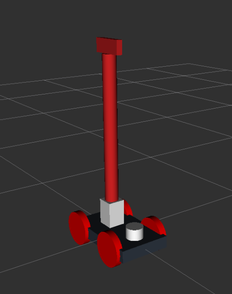

# the RoboCLuedo Project no.3 -- robot "hunter" URDF model -- User Manual

---

```{toctree}
---
caption: Contents
---
./robocluedo-hunter-user-manual.md
```

---

## Model file structure

inside the folder `robocluedo_hunter_urdf_model` there are these files:

- `generate_model.sh` is a script to tect the correctness of the model; it also generates a `.pdf` schematic of the model

- `robocluedo_xacro.xacro` is (as the name suggests) the XACRO model of a robot labeled **robocluedo_robot**. the model is split into three files:
	- `robocluedo_gazebo_materials` : graphical appearance of the robot
	- `robocluedo_chassis` : the moving platform of the robot
	- `robocluedo_arm` : the robotics arm
	- `robocluedo_arm_gripper` : the gripper of the robotic arm; it includes the link labeled *cluedo_link*
	- `robocluedo_gazebo_sensing` : definition of the Gazebo pluging related to the sensing; vision, laser, everything inside this file
	- `robocluedo_sensing` : this file contains the sensors mounted on the robot
	- `robocluedo_gazebo_plugins` : definition of the Gazebo plugins, without the sensing part
	- `robocluedo_transmission` : Gazebo controllers

## HOW TO generate the model

execute the file `generate_model.sh`; the URDF and its schematic will be located into the folder `model` with names 

- `robocluedo_urdf.urdf` for the URDF model, 
- and `robocluedo_urdf.pdf` for the schematic

the output should be like the following:

```text
robot name is: robocluedo_robot
---------- Successfully Parsed XML ---------------
root Link: base_link has 4 child(ren)
    child(1):  arm_base_link
        child(1):  arm_link_01
            child(1):  arm_link_02
                child(1):  arm_link_03
                    child(1):  cluedo_link
                        child(1):  left_grip_link
                        child(2):  right_grip_link
    child(2):  laser
    child(3):  link_left_wheel
    child(4):  link_right_wheel
Created file robocluedo_robot.gv
Created file robocluedo_robot.pdf
```

## HOW TO generate the package with Moveit 

first of all, use the setup assistant to generate the package. Inside the project, `robocluedo_robot`.

```bash
roslaunch moveit_setup_assistant setup.assistant.launch
```

the code generated by the setup assistant won't work at the beginning. Here are the fixes:

- In trajectory_execution.launch.xml, we need to comment line 21
- In config/ros_controllers.yaml, let's modify the gain of the proportional controllers
- In config/joint_limits.yaml let's set to 1 the scaling factor
- apply the gazebo world fix (see below)
- (optional) create the *run.launch* file
- (optional) setup the RViz environment
- (optional) RViz config file fix
- (optional) install MoveBase

### file ros_controllers.yaml

```yaml
# Simulation settings for using moveit_sim_controllers
moveit_sim_hw_interface:
  joint_model_group: arm_group
  joint_model_group_pose: extended
# Settings for ros_control_boilerplate control loop
generic_hw_control_loop:
  loop_hz: 300
  cycle_time_error_threshold: 0.01
# Settings for ros_control hardware interface
hardware_interface:
  joints:
    - arm_joint_01
    - arm_joint_02
    - arm_joint_03
    - arm_joint_04
    - joint_a_left_wheel
    - joint_a_right_wheel
    - joint_left_wheel
    - joint_right_wheel
  sim_control_mode: 1  # 0: position, 1: velocity
# Publish all joint states
# Creates the /joint_states topic necessary in ROS
joint_state_controller:
  type: joint_state_controller/JointStateController
  publish_rate: 50
controller_list:
  - name: arm_group_controller
    action_ns: follow_joint_trajectory
    default: True
    type: FollowJointTrajectory
    joints:
      - arm_joint_01
      - arm_joint_02
      - arm_joint_03
      - arm_joint_04
arm_group_controller:
  type: effort_controllers/JointTrajectoryController
  joints:
    - arm_joint_01
    - arm_joint_02
    - arm_joint_03
    - arm_joint_04
  gains:
    arm_joint_01:
      p: 10
      d: 0
      i: 0
      i_clamp: 0
    arm_joint_02:
      p: 10
      d: 0
      i: 0
      i_clamp: 0
    arm_joint_03:
      p: 10
      d: 0
      i: 0
      i_clamp: 0
    arm_joint_04:
      p: 10
      d: 0
      i: 0
      i_clamp: 0

```

### file joint_limits.yaml

```yaml
# joint_limits.yaml allows the dynamics properties specified in the URDF to be overwritten or augmented as needed

# For beginners, we downscale velocity and acceleration limits.
# You can always specify higher scaling factors (<= 1.0) in your motion requests.  # Increase the values below to 1.0 to always move at maximum speed.
default_velocity_scaling_factor: 1
default_acceleration_scaling_factor: 1

# Specific joint properties can be changed with the keys [max_position, min_position, max_velocity, max_acceleration]
# Joint limits can be turned off with [has_velocity_limits, has_acceleration_limits]
joint_limits:
  arm_joint_01:
    has_velocity_limits: true
    max_velocity: 0.2
    has_acceleration_limits: false
    max_acceleration: 0
  arm_joint_02:
    has_velocity_limits: true
    max_velocity: 0.2
    has_acceleration_limits: false
    max_acceleration: 0
  arm_joint_03:
    has_velocity_limits: true
    max_velocity: 0.2
    has_acceleration_limits: false
    max_acceleration: 0
  arm_joint_04:
    has_velocity_limits: true
    max_velocity: 0.5
    has_acceleration_limits: false
    max_acceleration: 0

```

### Gazebo world files fix

apply this code into the file **gazebo.launch** : 

```xml
  
<!-- world file -->
<arg name="world_name" default="square_room.world"/>
<arg name="world_path" default="$(find worlds)"/>
<arg name="world_file_path" default="$(arg world_path)/$(arg world_name)" />

<!-- startup simulated world -->
<include file="$(find gazebo_ros)/launch/empty_world.launch">
  <arg name="paused" value="$(arg paused)"/>
  <arg name="gui" value="$(arg gazebo_gui)"/>
  <arg name="world_name" value="$(arg world_file_path)" />
</include>

```

and apply this fix in the **demo_gazebo.launch** : 

```xml
<arg name="world_path" default="$(find worlds)"/>
<arg name="world_name" default="square_room.world"/>
<arg name="world_file_path" default="$(arg world_path)/$(arg world_name)" />
  
<!-- launch the gazebo simulator and spawn the robot -->
<include file="$(find robocluedo_robot)/launch/gazebo.launch" >
  <arg name="paused" value="$(arg paused)"/>
  <arg name="gazebo_gui" value="$(arg gazebo_gui)"/>
  <arg name="urdf_path" value="$(arg urdf_path)"/>
  <arg name="world_name" value="$(arg world_name)" />
  <arg name="world_path" value="$(arg world_path)" />
  <arg name="world_file_path" value="$(arg world_file_path)" />
</include>
```

### RViz config file fix

**demo.launch** : replace the RViz calling with this:

```xml
<arg name="rviz_config_file" default="moveit_2.rviz" />
<arg name="rviz_config_file_path" default="$(find robocluedo_robot_hunter)/config/rviz/moveit_2.rviz" />

<!-- Run Rviz and load the default config to see the state of the move_group node -->
<include file="$(find robocluedo_robot_hunter)/launch/moveit_rviz.launch" if="$(arg use_rviz)">
  <arg name="rviz_config" value="$(arg rviz_config_file_path)" />
  <arg name="debug" value="$(arg debug)"/>
</include>
```

**demo_gazebo.launch** : same work as before

```xml
<arg name="rviz_config_file" default="moveit_2.rviz" />
<arg name="rviz_config_file_path" default="$(find robocluedo_robot_hunter)/config/rviz/moveit_2.rviz" />

<!-- Run Rviz and load the default config to see the state of the move_group node -->
<include file="$(find robocluedo_robot_hunter)/launch/moveit_rviz.launch">
  <arg name="rviz_config" value="$(arg rviz_config_file_path)" />
  <arg name="debug" value="$(arg debug)"/>
</include>
```

### (optional) run.launch

```{note}
this launch file assumes that the other two fixes have been applied beforehand. 
```

```{note}
in case you want to install also the navigation stack, see the version below in this document. 
```

create a file named *run.launch* and paste this code:

```xml
<?xml version="1.0"?>

<launch>

<arg name="gazebo" default="true" />

<arg name="world_name" default="square_room.world"/>
<arg name="world_path" default="$(find worlds)"/>
<arg name="world_file_path" default="$(arg world_path)/$(arg world_name)" />

<arg name="rviz_config_file" default="moveit_2.rviz" />
<arg name="rviz_config_file_path" default="$(find robocluedo_robot_hunter)/config/rviz/moveit_2.rviz" />


<include file="$(find robocluedo_robot_hunter)/launch/demo_gazebo.launch" if="$(arg gazebo)" >
	<arg name="world_name" value="$(arg world_name)" />
	<arg name="world_path" value="$(arg world_path)" />
	<arg name="world_file_path" value="$(arg world_file_path)" />
	<arg name="rviz_config_file" value="$(arg rviz_config_file)" />
	<arg name="rviz_config_file_path" value="$(arg rviz_config_file_path)" />
</include>
<include file="$(find robocluedo_robot_hunter)/launch/demo.launch" unless="$(arg gazebo)" >
	<arg name="world_name" value="$(arg world_name)" />
	<arg name="world_path" value="$(arg world_path)" />
	<arg name="world_file_path" value="$(arg world_file_path)" />
	<arg name="rviz_config_file" value="$(arg rviz_config_file)" />
	<arg name="rviz_config_file_path" value="$(arg rviz_config_file_path)" />
</include>

</launch>
```

this allows to launch the robot model with Gazebo or without Gazebo:

```bash
# default: launch gazebo+RViz
roslaunch robocluedo_robot_hunter run.launch 

# launch RViz with Gazebo
roslaunch robocluedo_robot_hunter run.launch gazebo:=true

# launch RViz only
roslaunch robocluedo_robot_hunter run.launch gazebo:=false

```

this even allows to launch the simulation specifying the config file. **see the folder `robocluedo_robot_hunter/config/rviz`** containing all the RViz configuration files.

```bash
# default: moveit_2.rviz
roslaunch robocluedo_robot_hunter run.launch 

# other RViz config file
roslaunch robocluedo_robot_hunter run.launch  rviz_config_file:=moveit.rviz

 this is a specific file for the navigation stack
roslaunch robocluedo_robot_hunter run.launch  rviz_config_file:=sim_nav_stack.rviz

```

in case the RViz config file is not in that folder, you can give the complete path of the config file:

```bash
roslaunch robocluedo_robot_hunter run.launch  rviz_config_file_path:=/root/ros_ws/src/erl3/robocluedo_robot_hunter/config/rviz/sim_nav_stack.rviz

```

of course, you can combine all the options:

```bash
roslaunch robocluedo_robot_hunter run.launch gazebo:=true rviz_config_file:=sim_nav_stack.rviz world_name:=indoor.world

```

## HOW TO test the model with Gazebo

launch this:

```bash
roslaunch robocluedo_robot_hunter gazebo.launch
```

it should appear the robot, similar to this:




### HOW TO Launch the simulation with other worlds file

the package takes the world files from the package *worlds* located into the *robocluedo_depedencied* folder. The default world file is *square_room.world*. 

here's the syntax of the command:

```bash
roslaunch robocluedo_robot_hunter gazebo.launch world_name:=indoor.world

```

### HOW TO launch a world *outside the package worlds*

in case the world file is not included in the *worlds* package, you have two possibilities.

the first one is to specify both path and name in this way:

```bash
roslaunch robocluedo_robot_hunter demo_gazebo.launch world_name:=indoor.world world_file:=/root/ros_ws/src/erl2-new/robocluedo_dependencies/worlds

```

the second one is to directly specify the path with the variable `world_file_path`:

```bash
roslaunch robocluedo_robot_hunter demo_gazebo.launch world_file_path:=/root/ros_ws/src/erl2-new/robocluedo_dependencies/worlds/indoor.world

```

## RoboCLuedo Hunter sensors

the RoboCLuedo Hunter is endowed with four cameras:

- one camera at the fron of the chassis
- two camera at the two sides of the chassis
- one camera at the top of the arm

plus a laser sensor. 

### camera arm

```text
/robocluedo_robot/camera_arm/camera_info
/robocluedo_robot/camera_arm/image_raw
/robocluedo_robot/camera_arm/image_raw/compressed
/robocluedo_robot/camera_arm/image_raw/compressed/parameter_descriptions
/robocluedo_robot/camera_arm/image_raw/compressed/parameter_updates
/robocluedo_robot/camera_arm/image_raw/compressedDepth
/robocluedo_robot/camera_arm/image_raw/compressedDepth/parameter_descriptions
/robocluedo_robot/camera_arm/image_raw/compressedDepth/parameter_updates
/robocluedo_robot/camera_arm/image_raw/theora
/robocluedo_robot/camera_arm/image_raw/theora/parameter_descriptions
/robocluedo_robot/camera_arm/image_raw/theora/parameter_updates
/robocluedo_robot/camera_arm/parameter_descriptions
/robocluedo_robot/camera_arm/parameter_updates
```

### camera front low

```text
/robocluedo_robot/camera_front_low/camera_info
/robocluedo_robot/camera_front_low/image_raw
/robocluedo_robot/camera_front_low/image_raw/compressed
/robocluedo_robot/camera_front_low/image_raw/compressed/parameter_descriptions
/robocluedo_robot/camera_front_low/image_raw/compressed/parameter_updates
/robocluedo_robot/camera_front_low/image_raw/compressedDepth
/robocluedo_robot/camera_front_low/image_raw/compressedDepth/parameter_descriptions
/robocluedo_robot/camera_front_low/image_raw/compressedDepth/parameter_updates
/robocluedo_robot/camera_front_low/image_raw/theora
/robocluedo_robot/camera_front_low/image_raw/theora/parameter_descriptions
/robocluedo_robot/camera_front_low/image_raw/theora/parameter_updates
/robocluedo_robot/camera_front_low/parameter_descriptions
/robocluedo_robot/camera_front_low/parameter_updates
```

### camera left

```text
/robocluedo_robot/camera_left/camera_info
/robocluedo_robot/camera_left/image_raw
/robocluedo_robot/camera_left/image_raw/compressed
/robocluedo_robot/camera_left/image_raw/compressed/parameter_descriptions
/robocluedo_robot/camera_left/image_raw/compressed/parameter_updates
/robocluedo_robot/camera_left/image_raw/compressedDepth
/robocluedo_robot/camera_left/image_raw/compressedDepth/parameter_descriptions
/robocluedo_robot/camera_left/image_raw/compressedDepth/parameter_updates
/robocluedo_robot/camera_left/image_raw/theora
/robocluedo_robot/camera_left/image_raw/theora/parameter_descriptions
/robocluedo_robot/camera_left/image_raw/theora/parameter_updates
/robocluedo_robot/camera_left/parameter_descriptions
/robocluedo_robot/camera_left/parameter_updates
```

### camera right

```text
/robocluedo_robot/camera_right/camera_info
/robocluedo_robot/camera_right/image_raw
/robocluedo_robot/camera_right/image_raw/compressed
/robocluedo_robot/camera_right/image_raw/compressed/parameter_descriptions
/robocluedo_robot/camera_right/image_raw/compressed/parameter_updates
/robocluedo_robot/camera_right/image_raw/compressedDepth
/robocluedo_robot/camera_right/image_raw/compressedDepth/parameter_descriptions
/robocluedo_robot/camera_right/image_raw/compressedDepth/parameter_updates
/robocluedo_robot/camera_right/image_raw/theora
/robocluedo_robot/camera_right/image_raw/theora/parameter_descriptions
/robocluedo_robot/camera_right/image_raw/theora/parameter_updates
/robocluedo_robot/camera_right/parameter_descriptions
/robocluedo_robot/camera_right/parameter_updates
```

### topc Laser sensor

```text
/scan
```

## HOW TO install the navigation stack

```{note}
before installing the navigation stack as described below, check that the laser sensor of the robot is publishing on a topic named `/scan`. The plugin publishing the laser sensor is located in the folder `robocluedo_dependencies/robocluedo_hunter_urdf_model/robot/` file `robocluedo_gazebo_sensing.xacro`.
```

inside the package MoveIt,

- create a folder named *param*
- create the files described below (copy and paste from this documentation)
- create a new launch file for running the navigation stack
- (optional) launch the navigation stack from the *run.launch* file

### param -- base_local_planner_params.yaml

```yaml
TrajectoryPlannerROS:

# Robot Configuration Parameters
  max_vel_x: 0.8
  min_vel_x: 0.4

  max_vel_theta:  1.5
  min_vel_theta:  -1.5
  min_in_place_vel_theta: -1.0
  
  acc_lim_x: 0.5
  acc_lim_theta: 1.0

# Goal Tolerance Parameters
  yaw_goal_tolerance: 3.14
  xy_goal_tolerance: 0.3

# Forward Simulation Parameters
  sim_time: 2.0
  vx_samples: 10
  vtheta_samples: 40

# Trajectory Scoring Parameters
  meter_scoring: true
  pdist_scale: 5.0
  gdist_scale: 0.0
  occdist_scale: 5.0
  heading_lookahead: 5.0
  dwa: false
  global_frame_id: map

# Oscillation Prevention Parameters
  oscillation_reset_dist: 0.05

# Differential-drive robot configuration
  holonomic_robot: false
  max_vel_y: 0.0
  min_vel_y: 0.0
  acc_lim_y: 0.0
  vy_samples: 0

```

### param -- costmap_common_params.yaml

```yaml
max_obstacle_height: 0.60  
obstacle_range: 3.0
raytrace_range: 3.0
robot_radius: 0.15

# voxel map configuration; z-voxels 0 are filled by bumpers and 1 by laser scan (kinect)
map_type: voxel
origin_z: 0.0
z_resolution: 0.2
z_voxels: 2
publish_voxel_map: false

observation_sources: scan

scan: {data_type: LaserScan, topic: scan, marking: true, clearing: true, min_obstacle_height: 0.05, max_obstacle_height: 0.6}

```

### param -- global_costmap_params.yaml

```yaml
global_costmap:
   global_frame: map
   robot_base_frame: base_link
   update_frequency: 1.0
   publish_frequency: 0.5
   static_map: true
   transform_tolerance: 1.0
   inflation_layer:
        inflation_radius: 1.0
        cost_scaling_factor: 20

```

### param -- local_costmap_params.yaml

```yaml
local_costmap:
   global_frame: map
   robot_base_frame: base_link
   update_frequency: 1.0
   publish_frequency: 2.0
   static_map: false
   rolling_window: true
   width: 4.0
   height: 4.0
   resolution: 0.05
   transform_tolerance: 1.0
   inflation_layer:
        inflation_radius: 1.0
        cost_scaling_factor: 20

```

### param -- move_base_params.yaml

see also [move_base official wiki](http://www.ros.org/wiki/move_base)

```yaml
shutdown_costmaps: false

controller_frequency: 5.0
controller_patience: 5.0

planner_frequency: 5.0
planner_patience: 5.0

oscillation_timeout: 10.0
oscillation_distance: 0.05
```

### launch file *nav_stack.launch*

```xml
<?xml version="1.0"?>

<launch>
	
	<param name="use_sim_time" value="true"/>
	
	<!-- SLAM/GMapping -->
	<node pkg="gmapping" type="slam_gmapping" name="slam_gmapping">
		<param name="base_frame" value="base_link"/>
		<param name="map_update_interval" value="5.0"/>
		<param name="maxUrange" value="16.0"/>
		<param name="sigma" value="0.05"/>
		<param name="kernelSize" value="1"/>
		<param name="lstep" value="0.05"/>
		<param name="astep" value="0.03"/>
		<param name="iterations" value="3"/>
		<param name="lsigma" value="0.075"/>
		<param name="ogain" value="3.0"/>
		<param name="lskip" value="0"/>
		<param name="srr" value="0.1"/>
		<param name="srt" value="0.1"/>
		<param name="str" value="0.1"/>
		<param name="stt" value="0.1"/>
		<param name="linearUpdate" value="1.0"/>
		<param name="angularUpdate" value="0.2"/>
		<param name="temporalUpdate" value="3.0"/>
		<param name="resampleThreshold" value="0.5"/>
		<param name="particles" value="20"/>
		<param name="xmin" value="-50.0"/>
		<param name="ymin" value="-50.0"/>
		<param name="xmax" value="50.0"/>
		<param name="ymax" value="50.0"/>
		<param name="delta" value="0.05"/>
		<param name="llsamplerange" value="0.01"/>
		<param name="llsamplestep" value="0.01"/>
		<param name="lasamplerange" value="0.005"/>
		<param name="lasamplestep" value="0.005"/>
		<param name="transform_publish_period" value="0.0005"/>
	</node>
	
	<!-- move base -->
	<node pkg="move_base" type="move_base" respawn="false" name="move_base" output="screen">
		<rosparam file="$(find robocluedo_robot_hunter)/param/costmap_common_params.yaml" command="load" ns="global_costmap"/>
		<rosparam file="$(find robocluedo_robot_hunter)/param/costmap_common_params.yaml" command="load" ns="local_costmap"/>
		<rosparam file="$(find robocluedo_robot_hunter)/param/local_costmap_params.yaml" command="load"/>
		<rosparam file="$(find robocluedo_robot_hunter)/param/global_costmap_params.yaml" command="load"/>
		<rosparam file="$(find robocluedo_robot_hunter)/param/base_local_planner_params.yaml" command="load"/>
		<rosparam file="$(find robocluedo_robot_hunter)/param/move_base_params.yaml" command="load"/>
	</node>
	
</launch>

```

### new *run.launch* file

```xml
<?xml version="1.0"?>

<launch>

<arg name="gazebo" default="true" />

<arg name="use_nav_stack" default="true" />

<arg name="world_name" default="square_room.world"/>
<arg name="world_path" default="$(find worlds)"/>
<arg name="world_file_path" default="$(arg world_path)/$(arg world_name)" />

<arg name="rviz_config_file" default="sim_nav_stack.rviz" if="$(arg gazebo)"/>
<arg name="rviz_config_file_path" default="$(find robocluedo_robot_hunter)/config/rviz/sim_nav_stack.rviz" if="$(arg gazebo)"/>
<include file="$(find robocluedo_robot_hunter)/launch/demo_gazebo.launch" if="$(arg gazebo)" >
	<arg name="world_name" value="$(arg world_name)" />
	<arg name="world_path" value="$(arg world_path)" />
	<arg name="world_file_path" value="$(arg world_file_path)" />
	<arg name="rviz_config_file" value="$(arg rviz_config_file)" />
	<arg name="rviz_config_file_path" value="$(arg rviz_config_file_path)" />
</include>

<include file="$(find robocluedo_robot_hunter)/launch/nav_stack.launch" if="$(arg use_nav_stack)"/>

<arg name="rviz_config_file" default="moveit_2.rviz" unless="$(arg gazebo)"/>
<arg name="rviz_config_file_path" default="$(find robocluedo_robot_hunter)/config/rviz/moveit_2.rviz" unless="$(arg gazebo)"/>

<include file="$(find robocluedo_robot_hunter)/launch/demo.launch" unless="$(arg gazebo)" >
	<arg name="world_name" value="$(arg world_name)" />
	<arg name="world_path" value="$(arg world_path)" />
	<arg name="world_file_path" value="$(arg world_file_path)" />
	<arg name="rviz_config_file" value="$(arg rviz_config_file)" />
	<arg name="rviz_config_file_path" value="$(arg rviz_config_file_path)" />
</include>

</launch>
```

this version of the launch file adds a new parameter, `use_move_base` which allows to switch move_base when starting the simulation environment. 

```bash
roslaunch robocluedo_robot_hunter run.launch use_move_base:=true

```
