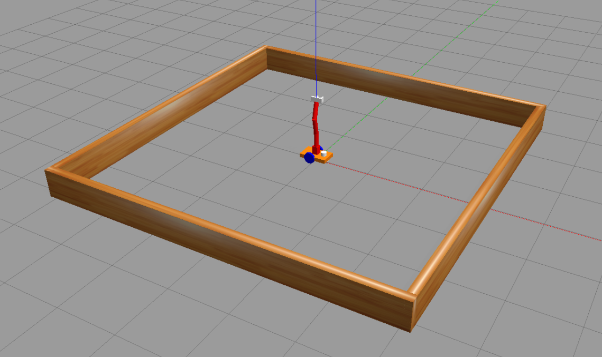
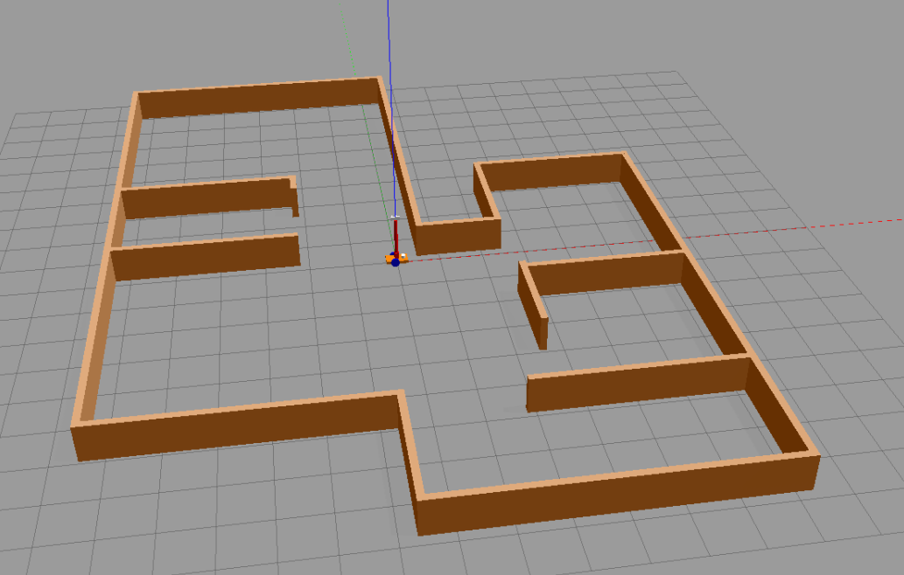
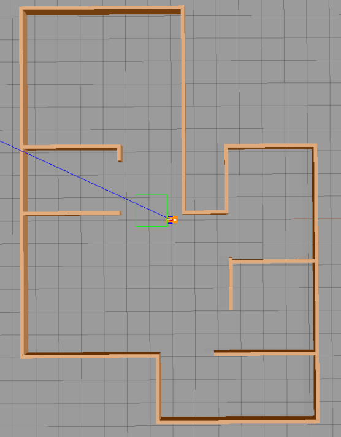

# WORLDS -- a collection of Gazebo World Files

```{toctree}
./worlds-user-manual.md
```

note that:

- the grid represents squares 1m by 1m
- **red** : x, **green** : y, **blue** : z

## file *square_room.world*

a 6x6 square room. the center of the room is the origin of the world frame. 



the environment is quite simple: just one root. the robot is spawned in the origin of the world frame. 

## file *indoor.world*

an empty indoor environment. here's how it appears:



here's the environment seen from the above:


